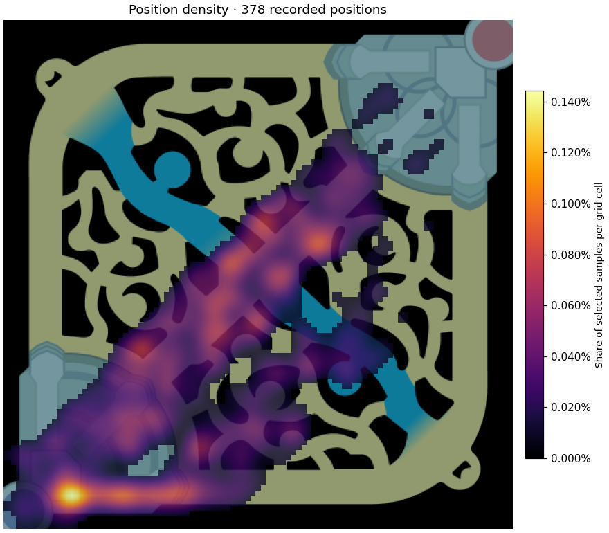

# LoL Heatmaps

Explore your League of Legends match patterns on Summoner’s Rift. Filter recorded
positions, kills, deaths, and assists; compare the same champion and role with a
reference built from matches sampled from high-elo accounts.

**Try it without an API key:** launch the app and click **Explore demo**.
The 12 demo matches are fictional, deterministic examples with no real player IDs.



## Run locally

Use **Python 3.12**. Run these commands in a terminal:

```bash
git clone https://github.com/dwmiquella/lolheatmap.git
cd lolheatmap
python -m venv .venv
```

Activate the environment:

```powershell
# Windows PowerShell
.\.venv\Scripts\Activate.ps1
```

```bash
# macOS / Linux
source .venv/bin/activate
```

Then install and launch:

```bash
python -m pip install -r requirements.txt
python -m streamlit run app.py
```

Open the local URL printed by Streamlit, normally `http://localhost:8501`.
If PowerShell blocks activation, use `.\.venv\Scripts\python.exe` in place of
`python` in the install and launch commands; no execution-policy change is needed.

## Analyze your matches

1. Click **Explore demo** to learn the controls, or connect your Riot account.
2. For real matches, enter your Riot ID (`Name#TAG`), server, queue, and match count.
3. Supply a Riot developer key in the local app, or copy `.env.example` to `.env`
   and set `RIOT_API_KEY`. Obtain your key from <https://developer.riotgames.com>.
4. Click **Analyze player**. Progress reports processed matches; eligible games
   exclude non-Summoner’s Rift maps and games shorter than five minutes.
5. Use **Your heatmap** for a large map, or enable the four-map overview. Sidebar
   filters also apply to **Champions**. Reset filters with one button.
6. Use **Compare** to select a champion, role, and five-minute time window.
7. Download the current map as PNG or champion statistics as CSV.

An unsuccessful new search leaves previous results visible with their original
player/server label. A mid-collection API failure preserves already loaded games
and displays a warning. Empty and invalid time windows are handled without crashing.

## How to read the maps

- Position density defaults to actual timeline samples, approximately one per minute.
  It is not an exact route or a precise measurement of time in an area.
- Optional interpolation estimates straight lines between those samples. It can
  cross terrain and cannot reliably reconstruct recalls, teleports, or movement.
- Maps are normalized to sum to one. Color represents the share of selected samples
  in a smoothed grid cell; it does not compare absolute event volume.
- Comparison panels share one color scale. Difference colors indicate more relative
  activity (red) or less (blue), **not better or worse play**.
- If either population has no events, the difference map is unavailable.
- Statistics always describe **full games**; time controls change only the maps.
- Longer games contribute more position samples. Repeated games from the same player
  are not independent evidence. Small cohorts are exploratory, not coaching advice.

## Comparison contract

Comparison deliberately has its own controls, separate from exploration filters.
Both populations use the same champion, role, reference queue, orientation, time
blocks, and position-construction method. Results and sides are pooled. The app
shows sample sizes, build date, patches, and available region metadata.

The bundled `data/benchmark.npz` is the existing legacy artifact, built on
2026-10-03 from 2,960 matches. It retains its original interpolated positions.
Its metadata lists patches 16.19 and 16.18 but does not retain complete patch
counts, region coverage, sampling settings, or unique-player counts. These missing
facts are not reconstructed or invented. Comparisons explicitly use interpolation
on both sides with this bundle. Rebuilt version-2 bundles use sampled positions.

Benchmark games may come from different patches and regions than your matches;
this is a descriptive reference, not a controlled or rank-adjusted experiment.
The legacy builder credited all participants in sampled apex-player matches, so
individual participants must not be described as verified Master+ players.

Missing champion/role references show a helpful empty state. The UI no longer
launches an expensive live scan as a fallback. The old live-scan helper remains
available to scripts through `lolheat.py`.

## Rebuild the reference

Set `RIOT_API_KEY` in your environment or `.env`, then run:

```bash
python build_benchmark.py --platform na1 --platform euw1 --platform kr --matches 2000
```

Use `--top-only` to count only the sampled apex-tier accounts (rank at collection
time, not necessarily match time), or `--tiers challenger,grandmaster` to narrow
sampling. Defaults count all participants in sampled matches and label that
population honestly.

New metadata includes all observed patch counts, configured regions and per-region
match counts, queue, sampling parameters, unique-player counts, cohort counts,
position method, and whether the run was interrupted. An empty build does not
replace a usable benchmark. File replacement is atomic.

Downloads are cached; reruns **restart aggregation using cached downloads** rather
than restoring an aggregation checkpoint. Ctrl+C saves eligible accumulated cohorts.
Review an interrupted result before committing it. Restart the app after replacing
a benchmark to clear in-memory caches.

The default client spacing is 1.25 seconds. Riot rate-limit responses are retried
using their retry delay. A first uncached search can take several minutes. Do not
lower the interval based solely on possessing a production key; use your actual quota.

## Configuration and hosting

- `.env`: local configuration, ignored by Git.
- `RIOT_API_KEY`: server-owned key; never inserted into browser widgets.
- `.streamlit/secrets.toml`: alternatively set `RIOT_API_KEY = "..."` on the server.
- `LOLHEAT_CACHE`: local JSON cache directory (default `cache/`).
- `RIOT_MIN_INTERVAL`: minimum spacing per client in seconds (default `1.25`).

This remains a local/small-use Streamlit app. Before a public multi-user deployment,
add a shared rate limiter/job queue across sessions and workers, usage controls,
and a cache retention policy. Per-client spacing is not a global quota manager.
No hosting or production API registration is performed by this update.

## Development

```bash
python -m pip install -r requirements-dev.txt
python -m ruff check .
python -m ruff format --check .
python -m pytest -q
```

GitHub Actions runs the same checks on Python 3.12. Dependency locks are resolved
for Python 3.12; edit the `.in` files and regenerate when updating dependencies:

```bash
python -m piptools compile --strip-extras -o requirements.txt requirements.in
python -m piptools compile --strip-extras -o requirements-dev.txt requirements-dev.in
```

| File/module | Responsibility |
| --- | --- |
| `app.py` | Forms, session state, filtering controls, chart rendering cache |
| `heatmap/riot_client.py` | Riot requests, retries, match collection |
| `heatmap/cache.py` | Slim payloads, atomic disk caching, corrupt-cache recovery |
| `heatmap/analysis.py` | Selection, statistics, points, time boundaries |
| `heatmap/plots.py` | Normalization, maps, shared color scales and legends |
| `heatmap/benchmark.py` | Reference loading |
| `heatmap/demo.py` | Small fictional dataset |
| `build_benchmark.py` | Offline reference generation |
| `lolheat.py` | Compatibility exports for older scripts |

See [CONTRIBUTING.md](CONTRIBUTING.md) and [the upgrade walkthrough](docs/UPGRADE.md).

## Troubleshooting

- **Key rejected:** refresh your key or check the host configuration.
- **Player not found:** check both parts of `Name#TAG` and the selected server.
- **No comparison:** load games in the reference queue (legacy bundle: ranked solo),
  then choose a champion/role present in both datasets.
- **Old cache:** old match entries without queue metadata are fetched again once.
- **Clear downloaded data:** stop the app and delete the local `cache/` directory.
  The bundled map and benchmark remain available.

## Credits and licensing

The map image is a Riot Games asset originally downloaded by this project's
Data Dragon integration; it is kept under `assets/` so demo mode works offline.
This update does not assign a new license to the existing project. The repository
owner should choose a code license before advertising reuse rights; Riot assets
remain subject to their own terms.

This project isn't endorsed by Riot Games and doesn't reflect the views or opinions
of Riot Games or anyone officially involved in producing or managing Riot Games
properties. Riot Games and all associated properties are trademarks or registered
trademarks of Riot Games, Inc.
